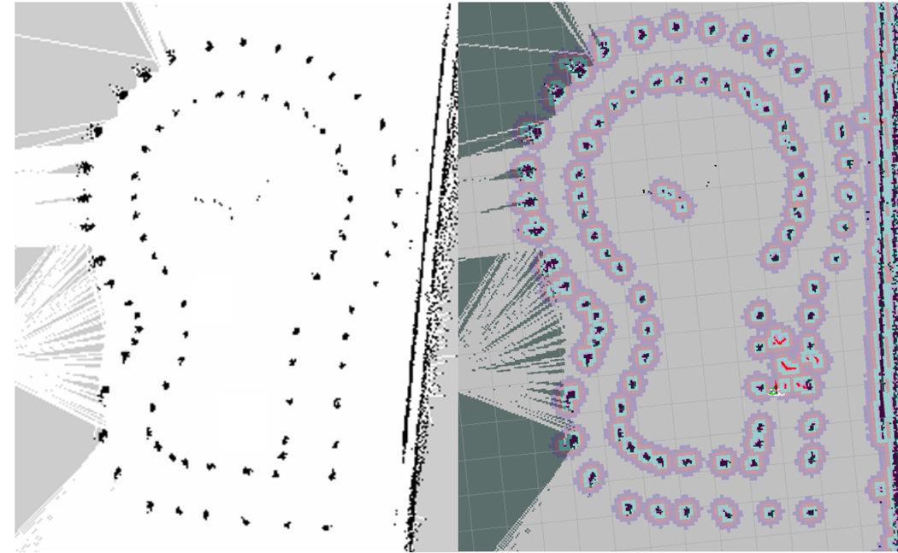

    

        

        
        

    

[//]: # (### RESEARCH INTERESTS)

[//]: # ()
[//]: # (The focus of my research is on the development of statistical methods for single-cell RNA-seq &#40;scRNA-seq&#41; and chromatin interaction &#40;Hi-C&#41; data analysis, and their application to the genetic dissection of complex diseases and traits. In particular, I have developed single-cell aggregated clustering methods &#40;implemented in software SAFE-clustering and SAME-clustering&#41; for flexible, accurate and robust clustering scRNA-seq data. In addition, I also work on batch effect correction for single-cell RNA-seq data, which takes advantages of cell type/cluster information to guide supervised mutual nearest neighbor detection &#40;SMNN method&#41;. More recently, I worked on the statistical framework for Hi-C peak calling &#40;MUNIn program&#41;, and identifying and characterizing cardiovascular cell types in mouse and the wounding-related cell dynamics in zebrafish.)

[//]: # ()
[//]: # (---)
###  EDUCATION

- 2021 - Present:  <b>Undergraduate/B.S. Student</b> 
    Major: Communications Engineering 
    School of Electronic information Engineering 
    Nanjing University of Information Science & Technology, NanJing, China 

---
### RESEARCH 

#### 2023.09 - Present Research on Low-Complexity Layered OFDM Method for Visible Light Communication
- Reproduced the DCO-OFDM, ACO-OFDM, LACO-OFDM, and ABLO-OFDM algorithms in Matlab.
- Proposed a **low latency, low complexity** transmission structure based on serial interference-free superposition transmission.
- **Project Achievements**: One paper in a top-tier Chinese journal (T3 category) as the first author, and one patent application as the first inventor.

#### 2023.09 - Present Research on Efficient O-OFDM Methods for Visible Light Communication Integrated with High-Precision Dimming (Under Review)
- Proposed a dimming method compatible with ABLO-OFDM, achieving **high-precision dimming control** by constructing a two-level PWM signal.
- Introduced a **pre-processing** procedure at the transmitter to prevent dimming control from affecting symbol transmission and signal detection at the receiver.
- The proposed method can directly use a **standard OFDM receiver** for signal detection, offering superior transmission performance.

### PROJECT

#### 2021.11 - 2022.08 National University Student Smart Car Competition,  17th, Pure four-wheel Racing, First Prize.
- Responsible for the control part of intelligent vehicles, deployed PID, ADRC, fuzzy control, and other control methods on the TC264 embedded platform. Multiple optimizations were made to the PID method, incorporating a TD component on top of the traditional PID.
- Implemented Ackermann differential steering on a four-wheel vehicle, and deployed simplified versions of Pure Pursuit and Stanley methods.

    

#### 2022.08 - 2022.12 National University Student Smart Car Competition,  17th, Ros Unmanned Racing, First Prize.
-  Familiar with ROS API, implemented various tasks for intelligent vehicles including visual tracking, radar tracking, SLAM mapping, and autonomous navigation. Based on existing tasks, proposed a highly simplified tracking model that significantly improved control effectiveness, ultimately achieving second place nationally.

    

#### 2023.2 - 2023.08 National University Student Smart Car Competition, 18th, Camera-equipped Tricycle, First Prize.

- Primary Lead: Responsible for the software aspect of image processing, achieving a complete control cycle for a 188*120 resolution grayscale image within 10ms. Optimized edge detection and binarization algorithms, proficient in digital image processing techniques. Deployed image algorithms on three platforms: QT, Matlab, and TC264.

- Deployed machine vision algorithms on the intelligent vehicle, utilizing techniques such as perspective transformation for distortion correction, trapezoid correction, and interpolation on images for car recognition.

- Based on the pure tracking algorithm, simplified the traditional three-ring cascaded control method, decoupled the speed loop from the direction loop, directly computed the differential speed coefficient needed for the tricycle, and achieved excellent control results using only a single speed loop for control.

    

[//]: # (### HONORS AND AWARDS)

[//]: # (2015 - 2017 Academic Scholarship Award of Chang Hungta Science Foundation, Sun Yat-sen University )

[//]: # (2015    National Scholarship Award for Graduate Students, China )

[//]: # (2015    Wang Bosun Ecology Scholarship Award, Sun Yat-sen University )

[//]: # (2015    Second Prize for Outstanding Graduate Award, State Key Laboratory of Biocontrol, Sun Yat-sen University )

[//]: # (2008 - 2010 First Prize Scholarship Award for Undergraduate Students, Sun Yat-Sen University )

[//]: # ()
[//]: # (---)

[//]: # (### CONTACT INFORMATION)

[//]: # ()
[//]: # (
)

[//]: # (    
)

[//]: # (            <b>Email</b>: 202183270006@nuist.edu.cn )

[//]: # (    
)

[//]: # (
)
